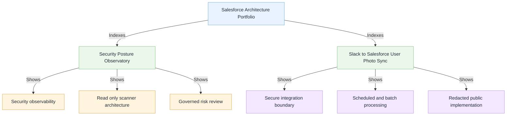

# Portfolio Overview

```mermaid
flowchart TD
    A[Salesforce Architecture Portfolio] -->|"Indexes"| B[Security Posture Observatory]
    A -->|"Indexes"| C[Slack to Salesforce User Photo Sync]
    B -->|"Shows"| D[Security observability]
    B -->|"Shows"| E[Read only scanner architecture]
    B -->|"Shows"| F[Governed risk review]
    C -->|"Shows"| G[Secure integration boundary]
    C -->|"Shows"| H[Scheduled and batch processing]
    C -->|"Shows"| I[Redacted public implementation]

    style A fill:#E8F3FF,stroke:#6AA6D8,color:#1F2937
    style B fill:#EAF7EA,stroke:#7CBF7C,color:#1F2937
    style C fill:#EAF7EA,stroke:#7CBF7C,color:#1F2937
    style D fill:#FFF4DE,stroke:#D8A84F,color:#1F2937
    style E fill:#FFF4DE,stroke:#D8A84F,color:#1F2937
    style F fill:#FFF4DE,stroke:#D8A84F,color:#1F2937
    style G fill:#F3E8FF,stroke:#B58BEA,color:#1F2937
    style H fill:#F3E8FF,stroke:#B58BEA,color:#1F2937
    style I fill:#F3E8FF,stroke:#B58BEA,color:#1F2937
```

No internal URLs, org identifiers, customer names, credentials, usernames or exact mappings are included.
