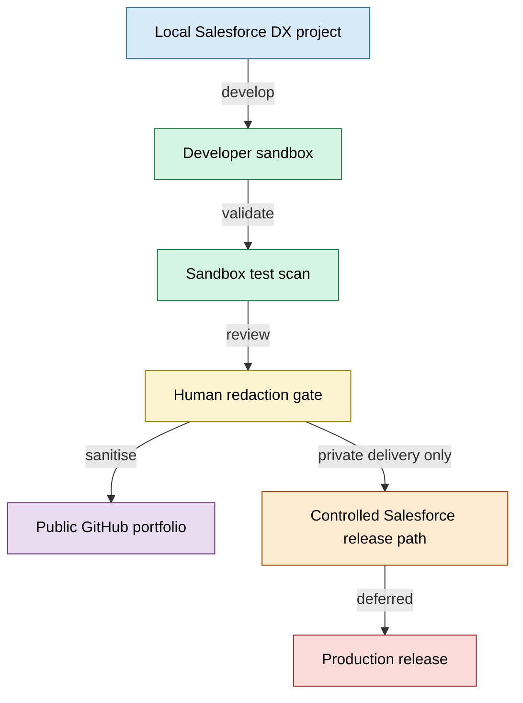

# Deployment Flow

## Diagram boundary

This diagram shows the public-safe delivery path.

The public repository is a portfolio artefact. It is not the production deployment source of truth.

Production release is deferred from this public package until a separate private review confirms source safety, test readiness, deployment controls and redaction boundaries.
