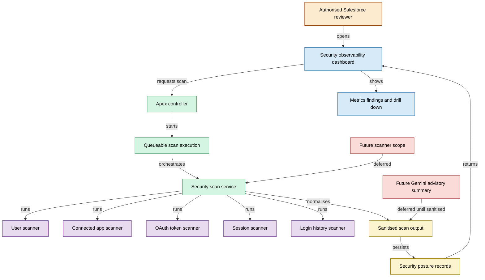

# High-Level Architecture

## Diagram boundary

This diagram is intentionally high-level.

It does not include org identifiers, usernames, internal URLs, credentials, exact Salesforce object mappings, exact scanner queries or proprietary risk rules.
